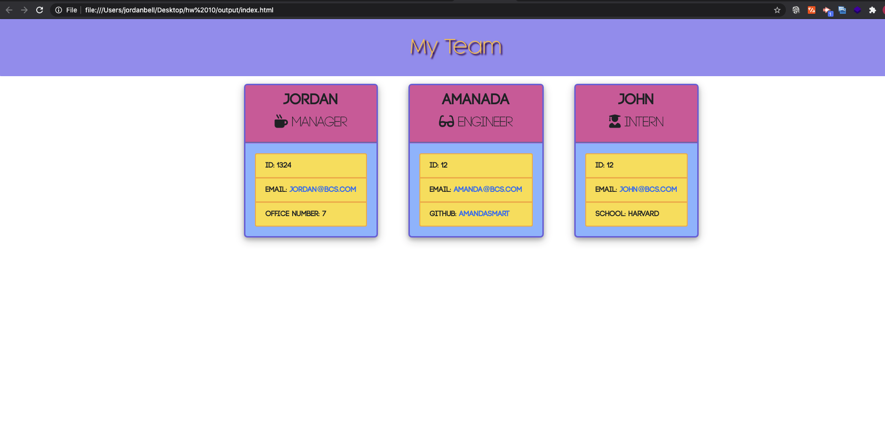

# Employee Summary

# Introduction:

This command line app is to build a software engineering team generator. The application will prompt the user for information about the team manager and then information about the team members. The user can input any number of team members, and they may be a mix of engineers and interns.

# User Story:

--As a manager
I want to generate a webpage that displays my team's basic info
so that I have quick access to emails and GitHub profiles

## License

This project is licensed under Apache 2.0 - see the https://www.apache.org/licenses/LICENSE-2.0.txt file for details

### Terminal Screen Shot

### Terminal Screen Shot

### Author

**Jordan Bell**

Email: jordymcbell@gmail.com

Location:Bay Area

GitHub: https://github.com/jordybell
Linkedin: Https://linkedin.com/in/jordan-bell

---
